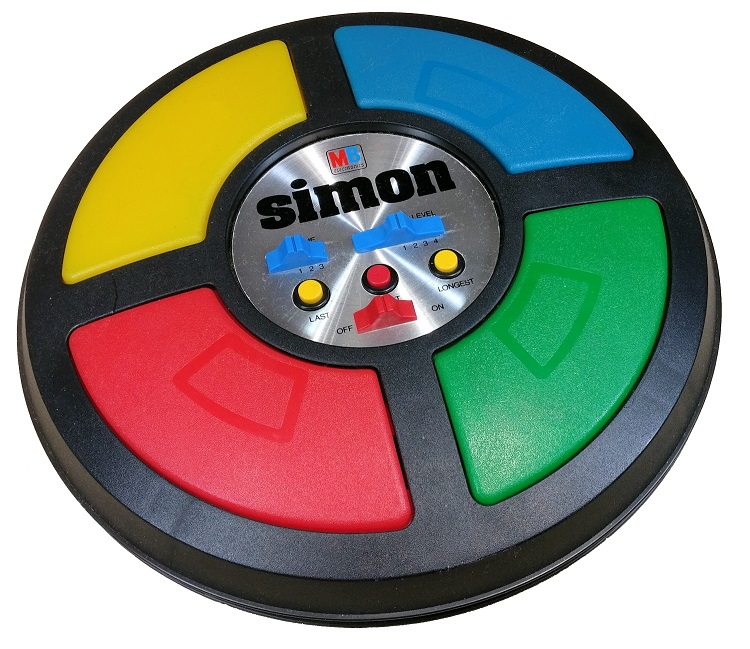

# SimonGame

## Welcome! 👋

Thanks for checking out this front-end coding mini-project.

## Table of contents

- [The Project](#the-project)
- [Project's Links](#links)
- [My process](#my-process)
- [Built with](#built-with)
- [What I learned](#what-i-learned)
- [Continued development](#continued-development)
- [Author](#author)

### The Project

- Build out the project to be similar to the real game.
- Imitating the real game design and functionalities using HTML/CSS/JavaScript
  

### Project's Links

- The Project Repo URL: (https://github.com/youssicode/SimonGame)
- Live Site URL: (https://youssicode.github.io/SimonGame/)

## My process

- Building the HTML structure / squeleton
- Styling the the different parts (Colored buttons, Control pannel,..)
- Writing the algoritm of the basic funtions of the game.
- Coding with JavaScript.
- Adding new functionalities and improving the basic ones (On-Off switch button, Strict mode, Number of rounds,..)
- Using Git to push/Upload all files and changes to github.com

### Built with

- HTML5 markup
- CSS
- Vanella JavaScript

### What I learned

- More practice with Vanella JavaScript.
- Dealing with nesting functions.
- Using setTimout() and setInterval() time methods.
- Using data attribute to store informations and filter elements.
- Improve problem solving methodology.

### Continued development

- Mastering JS.

## Author

- GitHub - [@youssicode](https://github.com/youssicode)
- LinkedIn - [@youssef-el-hrouzi](https://www.linkedin.com/in/youssef-el-hrouzi/)
- Facebook - [@youssef.elhrouzi](https://www.facebook.com/youssef.elhrouzi)
